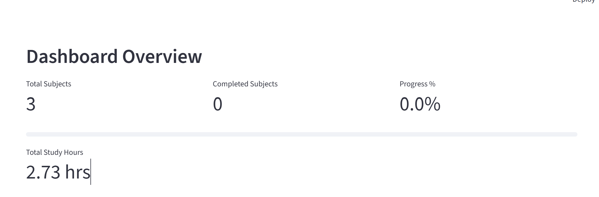
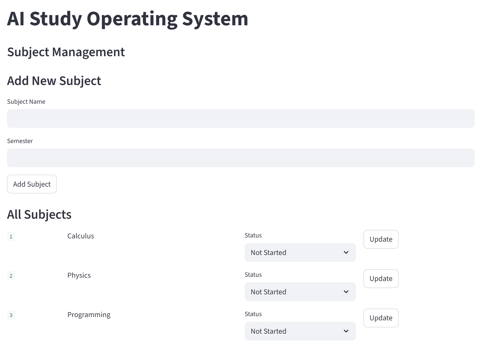
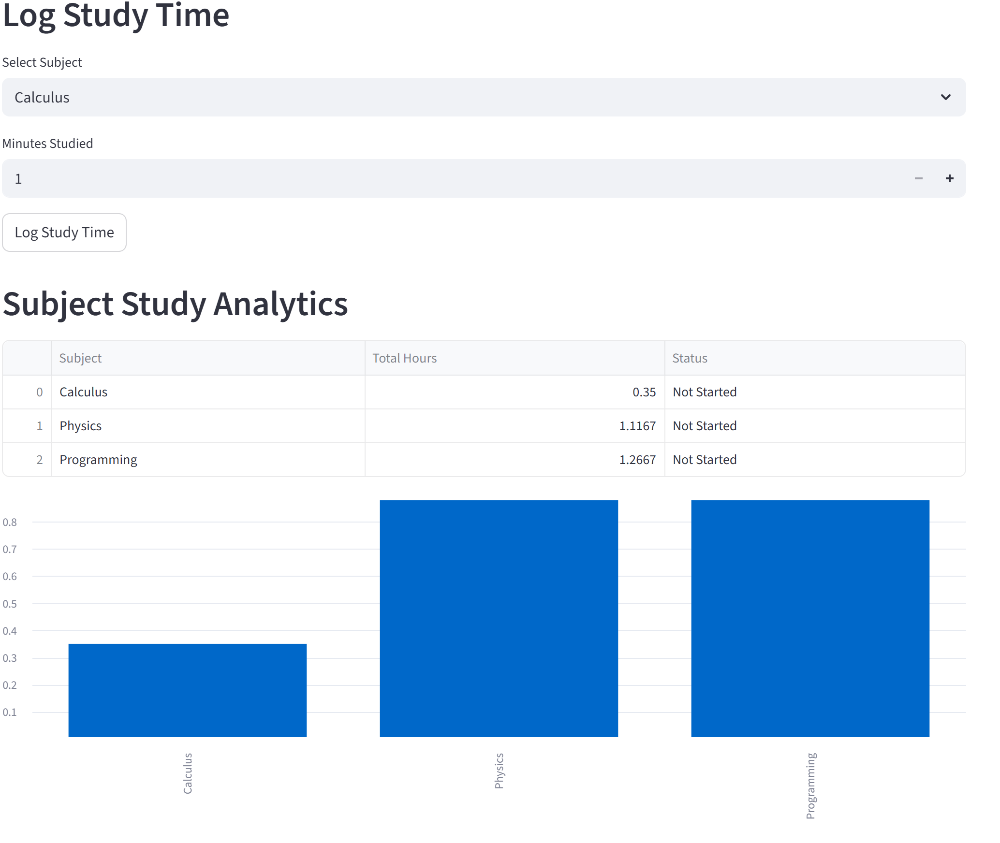
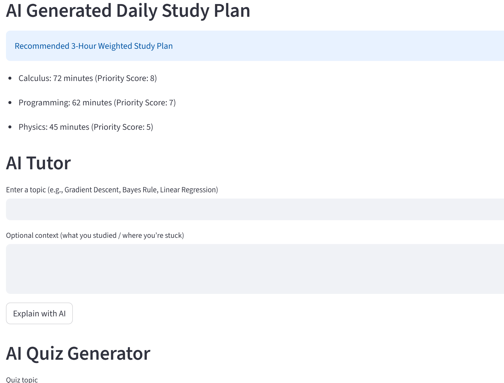
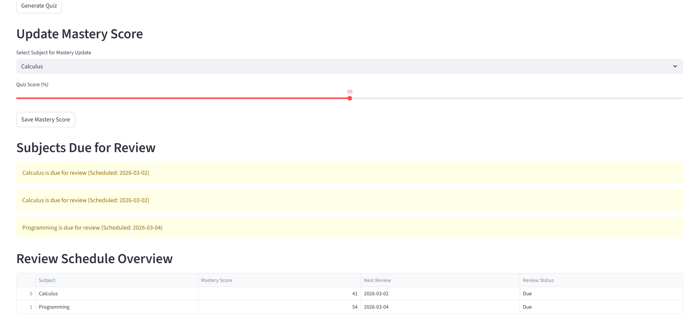

# AI Study Operating System (AI Study OS)

AI Study OS is a Python-based intelligent learning system that helps students track subjects, log study time, measure mastery, schedule reviews, and interact with an AI tutor.

The system combines study analytics, spaced repetition, and local AI tutoring into one integrated platform.

---

## Features

- Subject management
- Study time logging
- Progress dashboard
- Per-subject analytics
- Weak subject detection
- Adaptive daily study planning
- Mastery score tracking
- Spaced repetition review scheduling
- Review visibility dashboard
- Local AI tutor using Ollama
- Local AI quiz generation

---

## Technology Stack

- Python
- Streamlit
- SQLite
- Pandas
- Requests
- Ollama
- Mistral (local language model)

---

## Project Structure
ai_study_os/
│
├── app.py
├── README.md
├── requirements.txt
├── .gitignore
│
├── ai/
│ └── client.py
│
├── db/
│ └── database.py
│
├── assets/
│ └── screenshots/

---

## Installation

Clone the repository:

```bash
git clone https://github.com/YOUR_USERNAME/ai-study-os.git
cd ai-study-os
Create a virtual environment:

python -m venv venv

Activate it.

Windows:

venv\Scripts\activate

Mac/Linux:

source venv/bin/activate

Install dependencies:

pip install -r requirements.txt
Install Ollama

Download and install Ollama.

Then install the local model:

ollama pull mistral
Run the Application
streamlit run app.py

Open in browser:

http://localhost:8501
How It Works

Add subjects

Log study time

Track progress

Save mastery scores

Review scheduled topics

Use AI tutor for explanations

Generate quizzes

Follow the adaptive study plan

Future Improvements

automatic quiz grading

mastery trend graphs

calendar integration

multi-page UI

mobile access

cloud deployment

Author

Raj Thapa


## Screenshots

### Dashboard



### Subject Management



### Study Analytics



### AI Tutor



### Review Schedule



